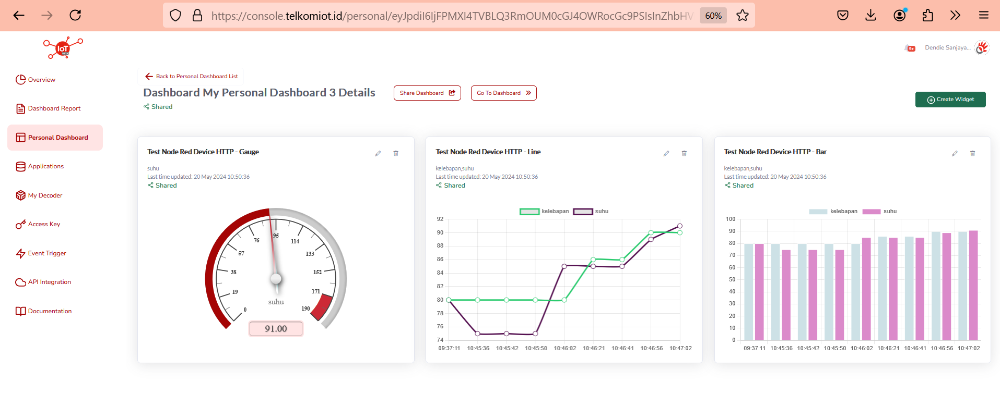
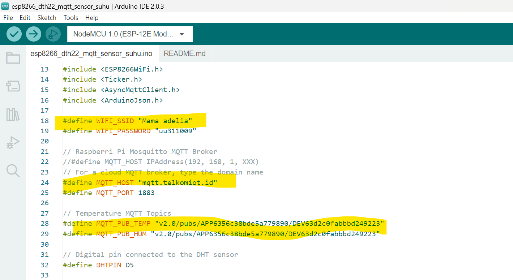
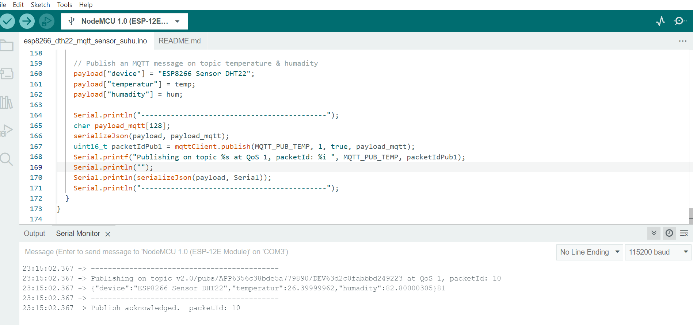
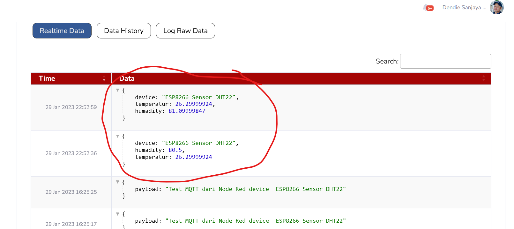

# Integration Arduion esp8266_dth22 MQTT Temperature Sensor to Telkom IoT Platform

Creating sensor integration from esp8266_dth22 device to Telkom IoT Platform, this program  write code arduion programming language to send sensor device data
through Wifi connection via MQTT protocol

# Telkom IoT Platform

Telkom IoT Platform is an IoT platform created by Telkom Indonesia which can be accessed publicly and for free (with limited features), this platform allows all IoT devices to send sensor data to the cloud which can then be processed in another form

Telkom IoT Platform can be accessed at :  https://console.telkomiot.id/

**esp8266**

ESP8266 is a very popular Wi-Fi module, which allows devices to connect to Wi-Fi networks and communicate over the internet. This module is often used in Internet of Things (IoT) projects because of its small size, affordable price, and ability to run its own code through an integrated microcontroller

**DHT22**

Sensor a temperature and humidity sensor known for its higher accuracy compared to the DHT11 (a simpler version).

This sensor can measure temperature in the range of -40 to +80 °C with an accuracy of around ±0.5°C, and humidity in the range of 0-100% RH with an accuracy of around ±2-5%.

# Device Info
Can be purchased at :
https://www.tokopedia.com/cncstorebandung/cnc-dht22-am2302-temperature-humidity-sensor-suhu-module-for-arduino

# Simple Guide

**1. This image to show device connection to wifi and subcribe topic mqtt to Telkom IoT Platform**

**2. This image to show device send data to Telkom IoT Platform**

**2. This image to show Telkom IoT Platform seara realtime get data from device**

## Contact

If you have questions, you can contact this email
Email: dendie.sanjaya@gmail.com

## License

This project is licensed under the MIT License.
